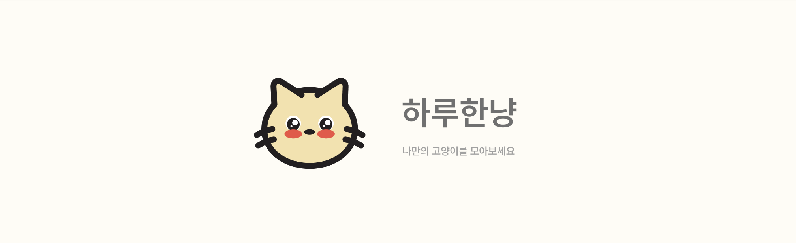
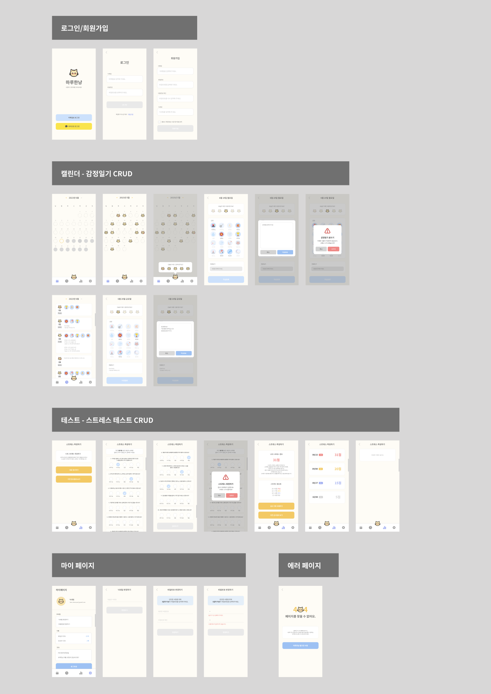
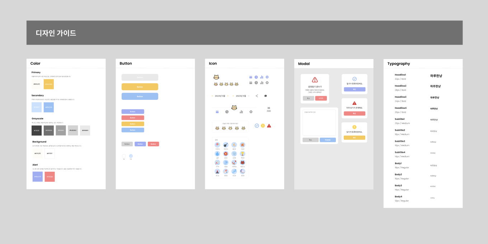
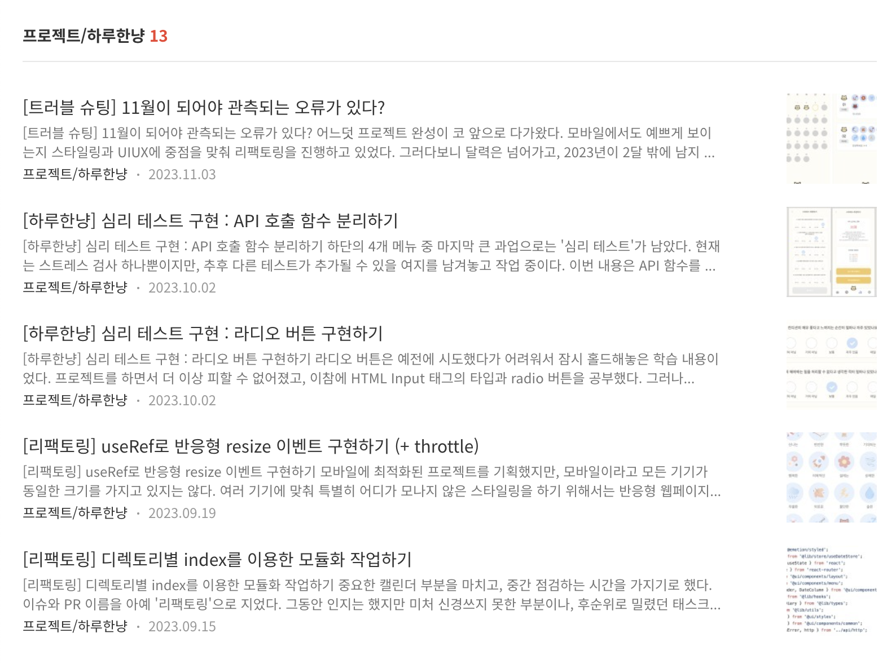

# 하루한냥을 소개합니다.

[🐱 하루한냥](http://haru-hannyan.com/) 은 **고양이 스티커로 하루를 기록하는 감정일기**입니다.   
일주일마다 **스트레스 자가 테스트**를 할 수 있어요. 나만의 고양이를 모아보세요!



- 📅 개발 기간 : 2023. 06 ~ 2023. 11

<br/>

## 프로젝트 실행 방법

### 설치 및 실행

```
git clone https://github.com/ShinjungOh/Haru-Hannyan

npm install
npm run dev
```


<br/>

## 하루한냥, 어떻게 만들었나요?  

### 피그마로 스토리보드를 기획했어요.

[🎨 Figma](https://www.figma.com/file/S88IviCMlCb4xS7rzNI5UK/%ED%95%98%EB%A3%A8%ED%95%9C%EB%83%A5?type=design&node-id=0%3A1&mode=design&t=r4R09lYfU7Jvpk4K-1)

하루한냥의 **디자인**과 **스타일 가이드**를 확인할 수 있어요.





<br/>

### 블로그에 개발 과정이 담겨있어요.

[✍️ Blog](https://shinjungoh.tistory.com/category/%ED%94%84%EB%A1%9C%EC%A0%9D%ED%8A%B8/%ED%95%98%EB%A3%A8%ED%95%9C%EB%83%A5)

하루한냥의 **탄생**과 **발전**을 볼 수 있어요.   
사용성을 높이기 위한 **리팩토링**과 어려움을 겪었던 **트러블 슈팅** 과정을 생생하게 담았어요.  



<br/>

### 깃허브 위키에서 프로젝트 세부사항을 볼 수 있어요.

[🔎 Github Wiki](https://github.com/ShinjungOh/Haru-Hannyan/wiki)

프로젝트가 **어떤 방식으로 진행**되었는지, **컨벤션**은 어떻게 되어있는지 확인할 수 있어요.  
**테스트**를 통해 하루한냥의 완성도를 어떻게 높였는지 알아보세요.

<br/>

## 기술스택

- bundler: vite
- package manager: npm
- library: React v18
- fetch: axios
- store: zustand
- css: emotion
- test: jest, react-testing-library
- CICD: husky, github actions
- linter, formatter: eslint, prettier


<br/>

## 프로젝트 구조

```
src
├── api
│   ├── diary
│   ├── report
│   ├── setting
│   └── user
├── assets
├── lib
│   ├── const
│   ├── hooks
│   ├── store
│   ├── types
│   └── utils
├── pages
└── ui
    ├── components
    │   ├── calendar
    │   ├── common
    │   ├── diary
    │   ├── layout
    │   ├── menu
    │   ├── modal
    │   ├── overlay
    │   ├── report
    │   └── setting
    └── styles
```

<br/>
